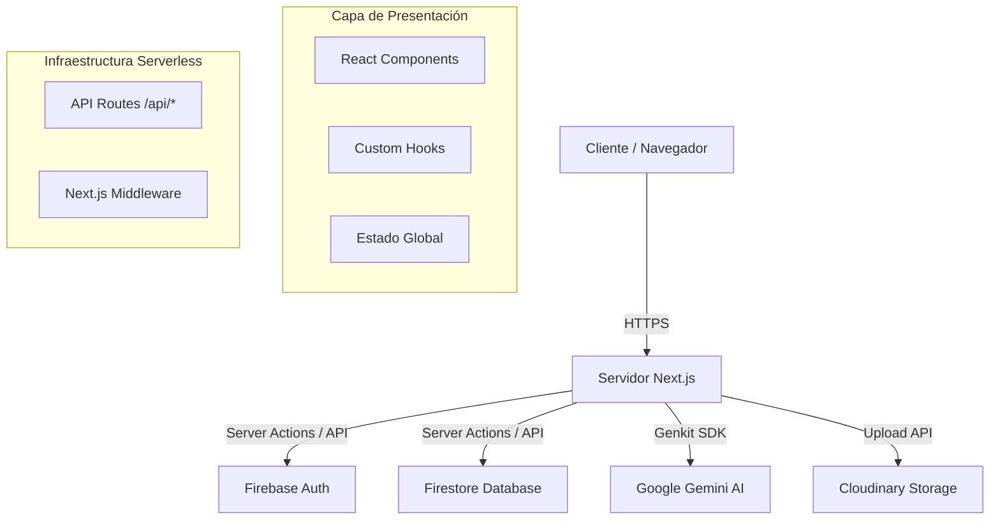

# Manual Técnico y Arquitectura - UIDEverse

Este documento detalla la arquitectura, tecnologías y decisiones de diseño del proyecto **UIDEverse**. Está estructurado para servir como guía técnica y documentación de defensa del proyecto.

---

## 🏗️ 1. Arquitectura del Sistema

El proyecto sigue una arquitectura **Serverless** y **Fullstack** moderna basada en el framework **Next.js 14**, aprovechando el **App Router** para unificar frontend y backend.

### Diagrama General de Componentes

---

## 📂 2. Estructura del Código

El proyecto sigue una estructura modular dentro de `src/`:

*   **`app/`**: Contiene las rutas de la aplicación.
    *   **`(auth)/`**: Grupo de rutas para Login/Registro (no afecta la URL).
    *   **`(dashboard)/`**: Grupo de rutas protegidas (Panel de Administración, Proyectos).
    *   **`api/`**: Endpoints del backend (e.g., `/api/ai/generate`).
*   **`ai/`**: Lógica específica de Inteligencia Artificial.
    *   **`genkit.ts`**: Configuración del modelo `gemini-2.5-flash`.
    *   **`flows.ts`**: Definición de flujos de entrada/salida tipados.
*   **`components/`**:
    *   **`ui/`**: Componentes base (Botones, Inputs) usando **Shadcn/UI**.
    *   **`layout/`**: Estructuras como Navbar, Sidebar, Footer.
*   **`lib/`**: Configuraciones de servicios externos (`firebase.ts`, `utils.ts`).
*   **`hooks/`**: Lógica encapsulada (e.g., `useAuth`, `useProjectFilters`).

---

## 🛠️ 3. Stack Tecnológico

### Frontend
*   **Framework:** Next.js 14 (React 18).
*   **Estilos:** Tailwind CSS (Utility-first CSS).
*   **Componentes:** Shadcn/UI (Radix UI headless + Tailwind).
*   **Iconos:** Lucide React.
*   **Gestión de Formularios:** React Hook Form + Zod (Validación de esquemas).

### Backend & Servicios
*   **Base de Datos:** Firebase Firestore (NoSQL).
*   **Autenticación:** Firebase Authentication.
*   **Inteligencia Artificial:** Google Genkit + Gemini 2.5 Flash.
*   **Almacenamiento de Archivos:** Cloudinary (Optimización automática de imágenes/PDFs).

---

## 🔒 4. Seguridad y Rendimiento

1.  **Protección de Rutas:**
    *   Uso de `hooks/use-auth` para verificar sesión en el cliente.
    *   Verificación de roles (`admin`, `superadmin`, `student`) antes de renderizar vistas sensibles.
    *   **Middleware (Opcional):** Para protección a nivel de servidor antes de llegar a la página.

2.  **Variables de Entorno:**
    *   Las llaves API sensibles (Firebase Admin, Gemini API Key) se manejan exclusivamente en el servidor (`.env.local`), nunca expuestas al cliente.

3.  **Optimización:**
    *   **Server Components:** La mayor parte de la UI se renderiza en el servidor para reducir el JavaScript enviado al cliente.
    *   **Image Optimization:** Uso de `next/image` para servir imágenes en formato WebP/AVIF.

---

## 🧠 5. Integración de IA (Genkit)

La IA no es un añadido superficial; es parte del flujo de creación de contenido.

*   **Flujo:** `generateProjectDescriptionFlow`
*   **Input:** Título, Categoría, Tecnologías.
*   **Proceso:** Se construye un prompt de sistema que instruye al modelo a actuar como un "Asistente Académico", asegurando un tono formal y técnico adecuado para la universidad.
*   **Output:** Texto estructurado listo para insertar en el editor.

---

## ❓ 6. Preguntas Frecuentes (Banco de Preguntas para Defensa)

### Arquitectura y Base de Datos

**P: ¿Por qué eligieron una base de datos NoSQL (Firestore) en lugar de SQL?**
*   **R:** Por la flexibilidad del esquema. Los proyectos estudiantiles pueden tener campos muy variables (diferentes tipos de enlaces, metadatos según la carrera). Firestore permite iterar rápido sin migraciones complejas de esquema. Además, su capacidad de tiempo real (listeners) facilita funcionalidades como notificaciones o chats futuros.

**P: ¿Cómo manejan la escalabilidad si la universidad crece a miles de usuarios?**
*   **R:** Firebase es una solución "Serverless" que escala automáticamente. Firestore maneja millones de lecturas/escrituras. Next.js, al estar desplegado en infraestructura serverless (como Vercel), crea instancias de las funciones API bajo demanda. El cuello de botella sería el costo, no la capacidad técnica.

**P: ¿Qué pasa si falla la API de Google Gemini?**
*   **R:** El sistema tiene manejo de errores (`try/catch`) en el endpoint `/api/ai/generate`. Si la IA falla, el usuario recibe una notificación visual (Toast) indicando el error, pero puede continuar llenando el formulario manualmente. La IA es una herramienta de asistencia, no un bloqueo crítico.

### Seguridad

**P: ¿Es seguro guardar las imágenes en Cloudinary?**
*   **R:** Sí. Cloudinary entrega URLs firmadas o públicas seguras (HTTPS). No guardamos los archivos binarios en nuestra base de datos (lo cual sería ineficiente), sino solo las referencias (URLs), manteniendo la BD ligera.

**P: ¿Cómo validan que un usuario es realmente estudiante?**
*   **R:** Actualmente validamos por el dominio del correo institucional en el registro o mediante un campo `isUideStudent` gestionado por administradores. En una fase futura, podríamos integrar SSO (Single Sign-On) con Microsoft/Google de la universidad.

### Desarrollo

**P: ¿Por qué usar Zod para validaciones?**
*   **R:** Zod permite definir el esquema de datos una sola vez y usarlo tanto para validar el formulario en el frontend como para tipar los datos en TypeScript (Single Source of Truth), reduciendo bugs por inconsistencia de datos.

**P: ¿Cuál fue el mayor desafío técnico?**
*   **R:** Integrar la paginación y filtrado en tiempo real en el dashboard de administración manteniendo el rendimiento, y asegurar que la latencia de la IA no afectara la experiencia de usuario (resuelto con estados de carga/loading skeletons).
